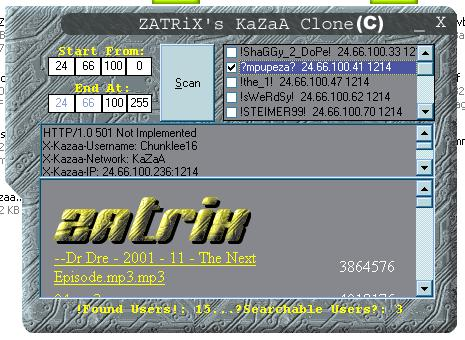



## ZATRiX's KaZaA Clone \[Winsock\]

### Description

This is another prog from my [Winsock] series! Basically what it does is scans for peeps with KaZaA RUNNING, and connects to port 1214 to view their shared files! I have also skinned my prog! Sorry, with my busy school schedule, i was unable to make comments, srry :(! There's one more thing...you can only open the people who share files such as *.mpg, *.mp3, *.wav, *.avi, *.jpg, etc...but not including *.exe. If someone comes up with a way of connecting to peeps with *.exe please do leave a comments. I'm not perfect so I rely on your opinion! Thanx alot...and enjoy!

P.S. It's rated Advanced simply because there are no comments! other wise its Intermediate!
 
### More Info
 

             |
---                |---
**Submitted On**   |2002-03-21 16:09:42
**By**             |[ZATRiX](https://github.com/Planet-Source-Code/PSCIndex/blob/master/ByAuthor/zatrix.md)
**Level**          |Advanced
**User Rating**    |4.4 (22 globes from 5 users)
**Compatibility**  |VB 6\.0
**Category**       |[Complete Applications](https://github.com/Planet-Source-Code/PSCIndex/blob/master/ByCategory/complete-applications__1-27.md)
**World**          |[Visual Basic](https://github.com/Planet-Source-Code/PSCIndex/blob/master/ByWorld/visual-basic.md)
**Archive File**   |[ZATRiX's\_K642713212002\.zip](https://github.com/Planet-Source-Code/zatrix-zatrix-s-kazaa-clone-winsock__1-32927/archive/master.zip)

